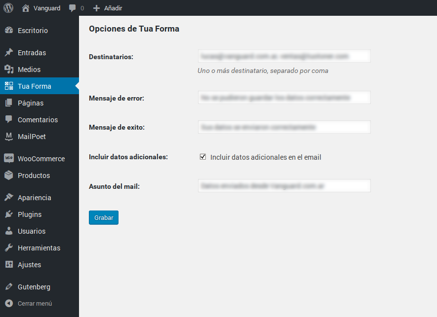
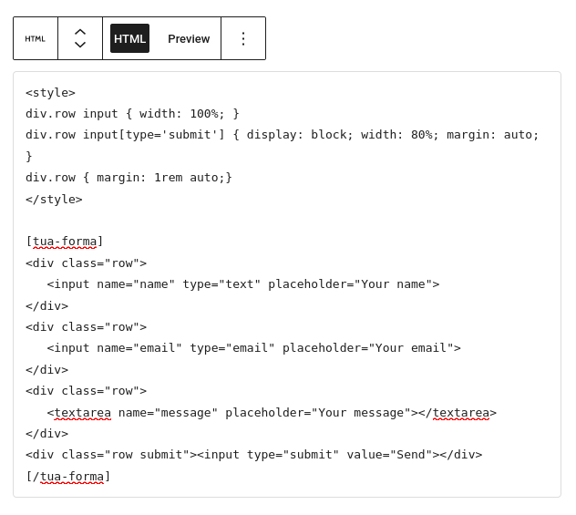
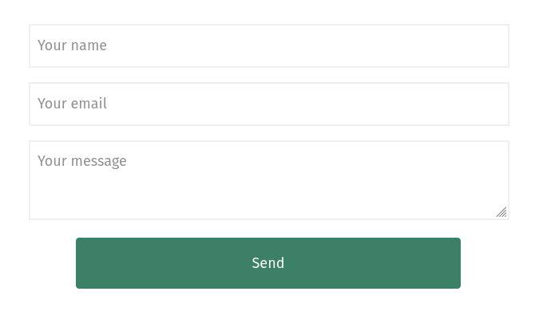

# Tua Forma

Un plugin pensado para diseñadores que necesitan plasmar formularios sin limitaciones,
este plugin solo se encarga de enviar los datos recolectados en el formulario por email.
Siéntete libre de definir tus propios campos, estilos, etc

No olvides nombrar cada campo del formulario y agregar el botón de envió.

## Install
https://wordpress.org/plugins/tua-forma/

## Easy WP SMTP
Puedes utilizar [Easy WP SMTP](https://es.wordpress.org/plugins/easy-wp-smtp/) para configuar un servidor SMTP

## Screenshot
### Admin page

### Shortcode example

### Result example

### Email example

